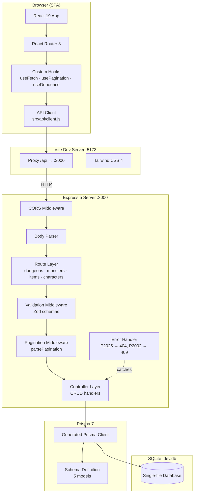

# Architecture Overview

Dungeon API v1 is a monolithic full-stack application that provides a REST API and single-page React frontend for managing fantasy RPG game data — dungeons, monsters, items, and characters. The backend is an Express 5 server with Zod-validated endpoints backed by SQLite via Prisma 7, while the frontend is a React 19 SPA with Tailwind CSS 4. The system follows a layered monolith pattern with clear separation between transport (routes), validation (schemas), business logic (controllers), and persistence (Prisma), all running as a single Node.js process with Vite's dev proxy bridging the frontend to the API.

## 1. Core Tech Stack & Dependencies

- **Backend Language:** JavaScript (ES Modules)
- **Frontend Language:** JavaScript (JSX, React 19)
- **Backend Framework:** Express 5.2
- **Frontend Framework:** React 19.2 with React Router 8.3
- **Styling:** Tailwind CSS 4.3 (Vite plugin, CSS-first config)
- **Build Tool:** Vite 8.1 with React Compiler (Babel)
- **Database:** SQLite via better-sqlite3 13.0
- **ORM:** Prisma 7.9 with `@prisma/adapter-better-sqlite3`
- **Validation:** Zod 4.4 (request bodies), OxLint 1.71 (code quality)
- **HTTP Client:** Native `fetch` (wrapped in `src/api/client.js`)
- **State Management:** React `useState` / `useEffect` (no external state library)
- **External Integrations:** None — fully self-contained

## 2. System Architecture & Component Diagram



## 3. Directory Layout & Code Map

```
dungeon-api-v1/
├── api/                          # Express backend (server-side)
│   ├── index.js                  # App entry — mounts middleware, routes, starts server
│   ├── lib/
│   │   └── prisma.js             # Singleton Prisma client (global-cached for HMR)
│   ├── middlewares/
│   │   ├── errorHandler.js       # Catch-all error handler (Prisma codes → HTTP status)
│   │   ├── pagination.js         # Parses page/limit/sort/order → req.pagination
│   │   └── validate.js           # Zod schema validator → req.body sanitization
│   ├── routes/                   # Express Router definitions per resource
│   │   ├── dungeons.js
│   │   ├── monsters.js
│   │   ├── items.js
│   │   └── characters.js
│   ├── controllers/              # Request handlers — business logic + Prisma queries
│   │   ├── dungeons.js
│   │   ├── monsters.js
│   │   ├── items.js
│   │   └── characters.js
│   └── schemas/                  # Zod schemas — create (required) + update (optional)
│       ├── dungeon.js
│       ├── monster.js
│       ├── item.js
│       └── character.js
├── prisma/                       # Database layer
│   ├── schema.prisma             # 5 models: Dungeon, Monster, Item, Character, Inventory
│   ├── seed.js                   # Deterministic sample data (6+22+16+8+18 records)
│   └── migrations/               # Auto-generated migration history
├── src/                          # React frontend (client-side)
│   ├── main.jsx                  # ReactDOM.createRoot entry
│   ├── App.jsx                   # Route tree with lazy-loaded pages
│   ├── index.css                 # Theme tokens (light/dark), fluid typography, Tailwind
│   ├── api/
│   │   └── client.js             # HTTP client wrapper (GET/POST/PUT/DELETE over /api)
│   ├── hooks/
│   │   ├── useFetch.js           # Data-fetching hook with abort-safe state
│   │   ├── usePagination.js      # Page state machine (next/prev/goTo/reset)
│   │   └── useDebounce.js        # 300ms input debounce
│   ├── context/
│   │   └── ToastContext.jsx      # Global toast state + portal renderer
│   ├── components/
│   │   ├── layout/
│   │   │   ├── Layout.jsx        # Page shell: Navbar + <Outlet> + Footer
│   │   │   ├── Navbar.jsx        # Sticky nav with mobile burger menu
│   │   │   └── Footer.jsx        # Responsive footer
│   │   └── ui/                   # Design system primitives
│   │       ├── Button.jsx        # 3 variants × 3 sizes, min 44px touch
│   │       ├── Input.jsx         # Label + error state
│   │       ├── Select.jsx        # Label + error state + options array
│   │       ├── Badge.jsx         # 5 color variants
│   │       ├── Modal.jsx         # Mobile sheet / desktop dialog
│   │       ├── Pagination.jsx    # Page buttons with ellipsis
│   │       ├── Loader.jsx        # Spinner
│   │       ├── EmptyState.jsx    # No-data placeholder
│   │       └── Skeleton.jsx      # Card, table, stats, detail shimmers
│   └── pages/                    # Route-level components (lazy loaded)
│       ├── Home.jsx              # Dashboard — entity counts + nav cards
│       ├── NotFound.jsx          # 404 page
│       ├── dungeons/
│       │   ├── DungeonList.jsx   # Card grid + search/filter + create modal
│       │   └── DungeonDetail.jsx # Monster table + edit/delete
│       ├── monsters/
│       │   ├── MonsterList.jsx   # Table + search/filter + create modal
│       │   └── MonsterDetail.jsx # Stat cards + edit/delete
│       ├── items/
│       │   ├── ItemList.jsx      # Table + search/filter + create modal
│       │   └── ItemDetail.jsx    # Description + owners grid + edit/delete
│       └── characters/
│           ├── CharacterList.jsx # Card grid + search/filter + create modal
│           └── CharacterDetail.jsx # Stat cards + inventory grid + edit/delete
├── vite.config.js                # Plugins + /api proxy config
├── DESIGN.md                     # Adobe-inspired design system documentation
├── README.md                     # Project documentation
└── package.json                  # Scripts, dependencies, Prisma seed config
```

## 4. Key Data Flows & Architectural Paths

### Flow A — List Entities (e.g., GET /api/monsters?search=fire&page=1)

```
1.  User types "fire" into search input.
2.  useDebounce fires after 300ms, updating debouncedSearch.
3.  useMemo rebuilds params: { page: 1, limit: 10, search: "fire" }.
4.  useFetch triggers, calls api.list("monsters", params).
5.  api/client.js builds URL: /api/monsters?page=1&limit=10&search=fire.
6.  Vite proxy forwards request to Express on :3000.
7.  parsePagination middleware extracts req.pagination = { page, limit, skip, sort, order }.
8.  Controller builds Prisma where clause: { name: { contains: "fire" } }.
9.  Prisma runs parallel queryMany + count against SQLite.
10. Response: { data: [...], page: 1, limit: 10, total: 3, totalPages: 1 }.
11. useFetch sets state → React re-renders table rows.
```

### Flow B — Create Entity (e.g., POST /api/dungeons)

```
1.  User clicks "+ New Dungeon", modal opens with form.
2.  User fills name, description, selects difficulty, submits.
3.  Page calls api.create("dungeons", { name, description, difficulty }).
4.  api/client.js sends POST /api/dungeons with JSON body.
5.  validate middleware runs Zod createDungeonSchema.safeParse(req.body).
6.  On failure → 400 { message, errors } → toast.error() → user sees inline field errors.
7.  On success → controller calls prisma.dungeon.create({ data: req.body }).
8.  Prisma generates SQL INSERT, executes against SQLite.
9.  Response: 201 { id, name, ..., createdAt, updatedAt }.
10. Page calls refetch() → useFetch re-runs GET → list updates with new entry.
11. Toast success notification appears.
```

### Flow C — Delete with Cascade (e.g., DELETE /api/dungeons/:id)

```
1.  User clicks "Delete" on DungeonDetail page.
2.  Browser confirm() dialog appears.
3.  On confirm, page calls api.remove("dungeons", id).
4.  api/client.js sends DELETE /api/dungeons/:id.
5.  Controller calls prisma.dungeon.delete({ where: { id } }).
6.  Prisma schema's onDelete: Cascade triggers → Monster rows with matching dungeonId deleted.
7.  SQLite transaction commits both deletions atomically.
8.  Response: 204 No Content.
9.  Page calls navigate("/dungeons") → SPA route transition.
10. DungeonList re-fetches → deleted dungeon no longer in results.
```

## 5. Architectural Decisions & Guardrails

### State Management

No external state library. All state is local to components via `useState`. Cross-cutting concerns use React Context:
- **ToastContext** — global notification queue, portal-rendered at document body.
- **useFetch** — per-component data-fetching with cancel-safe state updates and a manual `refetch()` trigger.
- **usePagination** — page state machine consumed by all list pages.
- **useDebounce** — 300ms delay on search inputs to avoid excessive API calls.

Data flows strictly downward: pages own data, pass it to child components. No prop drilling beyond 2 levels.

### Security & Auth

No authentication or authorization layer. The API is open by design — intended as a local development tool and portfolio project. Key protective measures:
- **Zod validation** on every write endpoint — rejects malformed input before it reaches Prisma.
- **CORS enabled** — allows cross-origin requests during development.
- **No secrets in code** — SQLite file path is hardcoded; no environment variables required.

For production use, authentication middleware (JWT/session) and CORS origin restrictions would be added at the route layer.

### Error Handling

**Backend:** A single Express error handler (`errorHandler.js`) catches all unhandled errors:
- Prisma `P2025` (record not found) → `404 { message: "Resource not found" }`
- Prisma `P2002` (unique constraint violation) → `409 { message: "A record with that {field} already exists" }`
- All other errors → `500 { message: "Internal server error" }`
- Zod validation failures → `400 { message: "Validation failed", errors: { field: [...] } }`

**Frontend:** The API client (`client.js`) normalizes all HTTP errors into a thrown `Error` object with `.status` and `.errors` properties. Pages catch these and route them to either:
- **Inline form errors** — `formErrors` state populates per-field messages below inputs.
- **Toast notifications** — `toast.error(message)` for unexpected failures.

### Data Integrity

Prisma schema enforces relational constraints:
- `Dungeon → Monster`: one-to-many with `onDelete: Cascade` — deleting a dungeon removes its monsters.
- `Character/Item → Inventory`: many-to-many junction with `onDelete: Cascade` on both sides.
- `Inventory`: `@@unique([characterId, itemId])` — prevents duplicate inventory entries per character.

### Frontend Architecture

- **Lazy loading** — all page components are `React.lazy()` loaded via `Suspense`, keeping the initial bundle under 80KB gzipped.
- **Vite proxy** — `/api` requests are forwarded to `:3000` in development, eliminating CORS issues and matching the production reverse-proxy pattern.
- **Mobile-first responsive** — breakpoints at 768px (burger menu), all interactive elements minimum 44px touch targets, fluid typography via `clamp()`.
